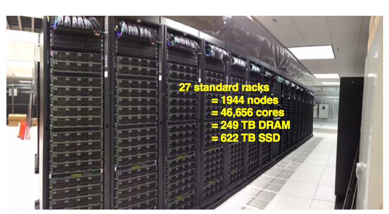

## Comet Overview:

### HPC for the "long tail of science:"
* Designed and operated on the principle that the majority of computational research is performed at modest scale: large number jobs that run for less than 48 hours, but can be computationally intensvie and generate large amounts of data.
* An NSF-funded system available through the eXtreme Science and Engineering Discovery Environment (XSEDE) program.
* Also supports science gateways.

* 2.76 Pflop/s peak
* 48,784 CPU cores
* 288 NVIDIA GPUs
* 247 TB total memory
* 634 TB total flash memory

[Back to Top](#top)

[Back to Top](#top)

* Lustre filesystems – Good for scalable large block I/O
* Accessible from all compute and GPU nodes.
* /oasis/scratch/comet - 2.5PB, peak performance: 100GB/s. Good location for storing large scale scratch data during a job.
* /oasis/projects/nsf - 2.5PB, peak performance: 100 GB/s. Long term storage.
* *Not good for lots of small files or small block I/O.*

* SSD filesystems
* /scratch local to each native compute node – 210GB on regular compute nodes, 285GB on GPU, large memory nodes, 1.4TB on selected compute nodes.
* SSD location is good for writing small files and temporary scratch files. Purged at the end of a job.

* Home directories (/home/$USER)
* Source trees, binaries, and small input files.
* *Not good for large scale I/O.*

[Back to Top](#top)

