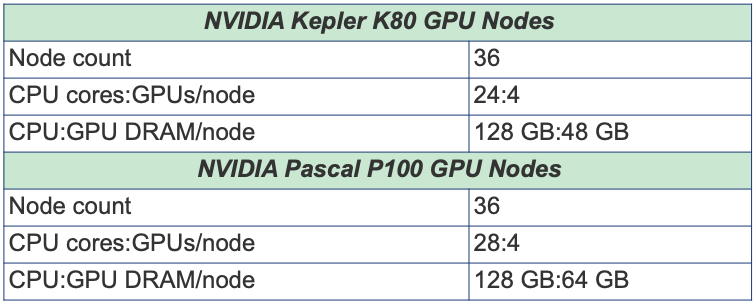

## <a name="comp-and-run-cuda-jobs"></a>Compiling and Running GPU/CUDA Jobs
<b>Sections:</b>
* [GPU Hello World (GPU) ](#hello-world-gpu)
* [GPU Enumeration ](#enum-gpu)
* [CUDA Mat-Mult](#mat-mul-gpu)

Note: Comet provides both NVIDIA K80 and P100 GPU-based resources. These GPU nodes
are allocated as separate resources. Make sure you have enough allocations and that
you are using the right account. For more details and current information about the
Comet GPU nodes, see the [Comet User Guide](https://www.sdsc.edu/support/user_guides/comet.html#gpu).

<b> Comet GPU Hardware: </b> <br>
<a name="gpu-hardware"></a>

## In order to compile the CUDA code, you need to load the CUDA module and verify
that you have access to the CUDA compile command, `nvcc:`
```
[mthomas@comet-ln3:~/comet101] module list
Currently Loaded Modulefiles:
1) intel/2018.1.163    2) mvapich2_ib/2.3.2
[mthomas@comet-ln3:~/comet101] module purge
[mthomas@comet-ln3:~/comet101] module load cuda
[mthomas@comet-ln3:~/comet101] module list
Currently Loaded Modulefiles:
1) cuda/10.1
[mthomas@comet-ln3:~/comet101] which nvcc
/usr/local/cuda-10.1/bin/nvcc
```

[Back to GPU/CUDA Jobs](#comp-and-run-cuda-jobs) <br>
[Back to Top](#top)
<hr>

### <a name="hello-world-gpu"></a>GPU/CUDA Example: Hello World
<b>Subsections:</b>
* [GPU Hello World: Compiling](#hello-world-gpu-compile)
* [GPU Hello World: Batch Script Submission](#hello-world-gpu-batch-submit)
* [GPU Hello World: Batch Job Output](#hello-world-gpu-batch-output)

#### <a name="hello-world-gpu-compile"></a>GPU Hello World: Compiling
Simple hello runs a cuda command to get the device count
on the node that job is assigned to. :
```
[mthomas@comet-ln3:~/comet101] cd CUDA/hello_cuda
[mthomas@comet-ln3:~/comet101/CUDA/hello_cuda] ll
total 30
drwxr-xr-x 2 mthomas use300   4 Apr 16 01:59 .
drwxr-xr-x 4 mthomas use300  11 Apr 16 01:57 ..
-rw-r--r-- 1 mthomas use300 313 Apr 16 01:59 hello_cuda.cu
-rw-r--r-- 1 mthomas use300 269 Apr 16 01:58 hello_cuda.sb
[mthomas@comet-ln3:~/comet101/CUDA/cuda_hello]  cat hello_cuda.cu
/*
* hello_cuda.cu
* Copyright 1993-2010 NVIDIA Corporation.
*    All right reserved
*/
#include <stdio.h>
#include <stdlib.h>
int main( void )
{
int deviceCount;
cudaGetDeviceCount( &deviceCount );
printf("Hello, Webinar Participants! You have %d devices\n", deviceCount );
return 0;
}
```
* Compile using the `nvcc`</b> command:
```
[mthomas@comet-ln3:~/comet101/CUDA/cuda_hello]  nvcc -o hello_cuda hello_cuda.cu
[mthomas@comet-ln3:~/comet101/CUDA/cuda_hello]  ll hello_cuda
-rwxr-xr-x 1 user use300 517437 Apr 10 19:35 hello_cuda
-rw-r--r-- 1 user use300    304 Apr 10 19:35 hello_cuda.cu
[comet-ln2:~/cuda/hello_cuda]

```
[Back to GPU/CUDA Jobs](#comp-and-run-cuda-jobs) <br>
[Back to Top](#top)
<hr>

#### <a name="hello-world-gpu-batch-submit"></a>GPU Hello World: Batch Script Submit

* GPU jobs can be run via the slurm scheduler, or on interactive nodes.
* The slurm scheduler batch script is shown below:
```
[mthomas@comet-ln3:~/comet101/CUDA/cuda_hello]  cat hello_cuda.sb
#!/bin/bash
#SBATCH --job-name="hello_cuda"
#SBATCH --output="hello_cuda.%j.%N.out"
#SBATCH --partition=gpu-shared
#SBATCH --nodes=1
#SBATCH --ntasks-per-node=12
#SBATCH --gres=gpu:2
#SBATCH -t 01:00:00

# Define the user environment
source /etc/profile.d/modules.sh
module purge
module load intel
module load mvapich2_ib
#Load the cuda module
module load cuda

#Run the job
./hello_cuda
```
* Some of the batch script variables are described below. For more details see
the Comet user guide.
* GPU nodes can be accessed via either the "gpu" or the "gpu-shared" partitions:
```
#SBATCH -p gpu           
```
or
```
#SBATCH -p gpu-shared
```

In addition to the partition name (required), the type of gpu (optional) and 
the individual GPUs are scheduled as a resource.
```
#SBATCH --gres=gpu[:type]:n
```

GPUs will be allocated on a first available, first schedule basis, unless specified with the [type] option, where type can be <b>`k80`</b> or <b>`p100`</b> Note: type is case sensitive.
```
#SBATCH --gres=gpu:4     #first available gpu node
#SBATCH --gres=gpu:k80:4 #only k80 nodes
#SBATCH --gres=gpu:p100:4 #only p100 nodes
```

<b>Submit the job</b> <br>

To run the job, type the batch script submission command:
```
[mthomas@comet-ln3:~/comet101/CUDA/cuda_hello]  sbatch hello_cuda.sb
Submitted batch job 32663172
[mthomas@comet-ln3:~/comet101/CUDA/cuda_hello]

```

<b>Monitor the job until it is finished:</b>
```
[user@comet-ln2:~/cuda/hello_cuda] squeue -u mthomas
[mthomas@comet-ln3:~/comet101/CUDA/cuda_hello] sbatch hello_cuda.sb
Submitted batch job 32663081
[mthomas@comet-ln3:~/comet101/CUDA/cuda_hello] squeue -u mthomas
JOBID PARTITION     NAME     USER ST       TIME  NODES NODELIST(REASON)
32663081 gpu-share hello_cu  mthomas PD       0:00      1 (Resources)
```

[Back to GPU/CUDA Jobs](#comp-and-run-cuda-jobs) <br>
[Back to Top](#top)
<hr>

#### <a name="hello-world-gpu-batch-output"></a>GPU Hello World: Batch Job Output
```
[mthomas@comet-ln3:~/comet101/CUDA/cuda_hello] cat hello_cuda.32663172.comet-30-04.out

Hello, Webinar Participants! You have 2 devices

[mthomas@comet-ln3:~/comet101/CUDA/cuda_hello]
```

[Back to GPU/CUDA Jobs](#comp-and-run-cuda-jobs) <br>
[Back to Top](#top)
<hr>


### <a name="enum-gpu"></a>GPU/CUDA Example: Enumeration

Sections:
* [GPU Enumeration: Compiling](#enum-gpu-compile)
* [GPU Enumeration: Batch Script Submission](#enum-gpu-batch-submit)
* [GPU Enumeration: Batch Job Output](#enum-gpu-batch-output )

<hr>

#### <a name="enum-gpu-compile"></a>GPU Enumeration: Compiling

<b>GPU Enumeration Code:</b>
This code accesses the cudaDeviceProp object and returns information about the devices on the node. The list below is only some of the information that you can look for. The property values can be used to dynamically allocate or distribute your compute threads accross the GPU hardware in response to the GPU type.
```
[user@comet-ln2:~/cuda/gpu_enum] cat gpu_enum.cu
#include <stdio.h>

int main( void ) {
cudaDeviceProp prop;
int count;
printf( " --- Obtaining General Information for CUDA devices  ---\n" );
cudaGetDeviceCount( &count ) ;
for (int i=0; i< count; i++) {
cudaGetDeviceProperties( &prop, i ) ;
printf( " --- General Information for device %d ---\n", i );
printf( "Name: %s\n", prop.name );

printf( "Compute capability: %d.%d\n", prop.major, prop.minor );
printf( "Clock rate: %d\n", prop.clockRate );
printf( "Device copy overlap: " );

if (prop.deviceOverlap)
printf( "Enabled\n" );
else
printf( "Disabled\n");

printf( "Kernel execution timeout : " );

if (prop.kernelExecTimeoutEnabled)
printf( "Enabled\n" );
else
printf( "Disabled\n" );

printf( " --- Memory Information for device %d ---\n", i );
printf( "Total global mem: %ld\n", prop.totalGlobalMem );
printf( "Total constant Mem: %ld\n", prop.totalConstMem );
printf( "Max mem pitch: %ld\n", prop.memPitch );
printf( "Texture Alignment: %ld\n", prop.textureAlignment );
printf( " --- MP Information for device %d ---\n", i );
printf( "Multiprocessor count: %d\n", prop.multiProcessorCount );
printf( "Shared mem per mp: %ld\n", prop.sharedMemPerBlock );
printf( "Registers per mp: %d\n", prop.regsPerBlock );
printf( "Threads in warp: %d\n", prop.warpSize );
printf( "Max threads per block: %d\n", prop.maxThreadsPerBlock );
printf( "Max thread dimensions: (%d, %d, %d)\n", prop.maxThreadsDim[0], prop.maxThreadsDim[1], prop.maxThreadsDim[2] );
printf( "Max grid dimensions: (%d, %d, %d)\n", prop.maxGridSize[0], prop.maxGridSize[1], prop.maxGridSize[2] );
printf( "\n" );
}
}
```

To compile: check your environment and use the CUDA <b>`nvcc`</b> command:
```
[comet-ln2:~/cuda/gpu_enum] module purge
[comet-ln2:~/cuda/gpu_enum] which nvcc
/usr/bin/which: no nvcc in (/usr/lib64/qt-3.3/bin:/usr/local/bin:/bin:/usr/bin:/usr/local/sbin:/usr/sbin:/sbin:/opt/sdsc/bin:/opt/sdsc/sbin:/opt/ibutils/bin:/usr/java/latest/bin:/opt/pdsh/bin:/opt/rocks/bin:/opt/rocks/sbin:/home/user/bin)
[comet-ln2:~/cuda/gpu_enum] module load cuda
[comet-ln2:~/cuda/gpu_enum] which nvcc
/usr/local/cuda-7.0/bin/nvcc
[comet-ln2:~/cuda/gpu_enum] nvcc -o gpu_enum -I.  gpu_enum.cu
[comet-ln2:~/cuda/gpu_enum] ll gpu_enum
-rwxr-xr-x 1 user use300 517632 Apr 10 18:39 gpu_enum
[comet-ln2:~/cuda/gpu_enum]
```
[Back to GPU/CUDA Jobs](#comp-and-run-cuda-jobs) <br>
[Back to Top](#top)
<hr>

#### <a name="enum-gpu-batch-submit"></a>GPU Enumeration: Batch Script Submission
<b>Contents of the Slurm script </b>
Script is asking for 1 GPU.

```
[comet-ln2: ~/cuda/gpu_enum] cat gpu_enum.sb
#!/bin/bash
#SBATCH --job-name="gpu_enum"
#SBATCH --output="gpu_enum.%j.%N.out"
#SBATCH --partition=gpu-shared          # define GPU partition
#SBATCH --nodes=1
#SBATCH --ntasks-per-node=6
#SBATCH --gres=gpu:1         # define type of GPU
#SBATCH -t 00:05:00

# Define the user environment
source /etc/profile.d/modules.sh
module purge
module load intel
module load mvapich2_ib
#Load the cuda module
module load cuda

#Run the job
./gpu_enum

```

<b>Submit the job </b>
* To run the job, type the batch script submission command:
```
[mthomas@comet-ln3:~/comet101/CUDA/gpu_enum] sbatch hello_cuda.sb
Submitted batch job 32663364

```
<b>Monitor the job </b>
* You can monitor the job until it is finished using the `sqeue` command:
```
[mthomas@comet-ln3:~/comet101/CUDA/gpu_enum] squeue -u mthomas
JOBID PARTITION     NAME     USER ST       TIME  NODES NODELIST(REASON)
32663364 gpu-share gpu_enum  mthomas PD       0:00      1 (Resources)

```
[Back to GPU/CUDA Jobs](#comp-and-run-cuda-jobs) <br>
[Back to Top](#top)
<hr>

#### <a name="enum-gpu-batch-output"></a>GPU Enumeration: Batch Job Output

* Output from script is for multiple devices, which is what was specified in script.

```
[user@comet-ln2:~/cuda/gpu_enum] cat gpu_enum.22527745.comet-31-10.out
--- Obtaining General Information for CUDA devices  ---
--- General Information for device 0 ---
--- Obtaining General Information for CUDA devices  ---
--- General Information for device 0 ---
Name: Tesla P100-PCIE-16GB
Compute capability: 6.0
Clock rate: 1328500
Device copy overlap: Enabled
Kernel execution timeout : Disabled
--- Memory Information for device 0 ---
Total global mem: 17071734784
Total constant Mem: 65536
Max mem pitch: 2147483647
Texture Alignment: 512
--- MP Information for device 0 ---
Multiprocessor count: 56
Shared mem per mp: 49152
Registers per mp: 65536
Threads in warp: 32
Max threads per block: 1024
Max thread dimensions: (1024, 1024, 64)
Max grid dimensions: (2147483647, 65535, 65535)
```
* If we change the batch script to ask for 2 devices (see line 8):
```
1 #!/bin/bash
2 #SBATCH --job-name="gpu_enum"
3 #SBATCH --output="gpu_enum.%j.%N.out"
4 #SBATCH --partition=gpu-shared          # define GPU partition
5 #SBATCH --nodes=1
6 #SBATCH --ntasks-per-node=6
7 ####SBATCH --gres=gpu:1         # define type of GPU
8 #SBATCH --gres=gpu:2         # first available
9 #SBATCH -t 00:05:00
10
11 # Define the user environment
12 source /etc/profile.d/modules.sh
13 module purge
14 module load intel
15 module load mvapich2_ib
16 #Load the cuda module
17 module load cuda
18
19 #Run the job
20 ./gpu_enum
```

The output will show information for two devices:
```
[mthomas@comet-ln3:~/comet101/CUDA/gpu_enum] sbatch gpu_enum.sb
!Submitted batch job 32663404
[mthomas@comet-ln3:~/comet101/CUDA/gpu_enum] squeue -u mthomas
JOBID PARTITION     NAME     USER ST       TIME  NODES NODELIST(REASON)
32663404 gpu-share gpu_enum  mthomas CG       0:02      1 comet-33-03
[mthomas@comet-ln3:~/comet101/CUDA/gpu_enum] cat gpu_enumX.32663404.comet-33-03.out
--- Obtaining General Information for CUDA devices  ---
--- General Information for device 0 ---
Name: Tesla P100-PCIE-16GB
Compute capability: 6.0
Clock rate: 1328500
Device copy overlap: Enabled
Kernel execution timeout : Disabled
--- Memory Information for device 0 ---
Total global mem: 17071734784
Total constant Mem: 65536
Max mem pitch: 2147483647
Texture Alignment: 512
--- MP Information for device 0 ---
Multiprocessor count: 56
Shared mem per mp: 49152
Registers per mp: 65536
Threads in warp: 32
Max threads per block: 1024
Max thread dimensions: (1024, 1024, 64)
Max grid dimensions: (2147483647, 65535, 65535)

--- General Information for device 1 ---
Name: Tesla P100-PCIE-16GB
Compute capability: 6.0
Clock rate: 1328500
Device copy overlap: Enabled
Kernel execution timeout : Disabled
--- Memory Information for device 1 ---
Total global mem: 17071734784
Total constant Mem: 65536
Max mem pitch: 2147483647
Texture Alignment: 512
--- MP Information for device 1 ---
Multiprocessor count: 56
Shared mem per mp: 49152
Registers per mp: 65536
Threads in warp: 32
Max threads per block: 1024
Max thread dimensions: (1024, 1024, 64)
Max grid dimensions: (2147483647, 65535, 65535)
```

[Back to GPU/CUDA Jobs](#comp-and-run-cuda-jobs) <br>
[Back to Top](#top)
<hr>

### <a name="mat-mul-gpu"></a>GPU/CUDA Example: Matrix-Multiplication
<b>Subsections:</b>
* [Matrix Mult. (GPU): Compiling](#mat-mul-gpu-compile)
* [Matrix Mult. (GPU): Batch Script Submission](#mat-mul-gpu-batch-submit)
* [Matrix Mult. (GPU): Batch Job Output](#mat-mul-gpu-batch-output )

#### <a name="mat-mul-gpu"></a>CUDA Example: Matrix-Multiplication
<b>Change to the CUDA Matrix-Multiplication example directory:</b>
```
[mthomas@comet-ln3:~/comet101/CUDA/matmul] ll
total 454
drwxr-xr-x 2 mthomas use300     11 Apr 16 02:59 .
drwxr-xr-x 5 mthomas use300      5 Apr 16 02:37 ..
-rw-r--r-- 1 mthomas use300    253 Apr 16 01:56 cuda_matmul.sb
-rw-r--r-- 1 mthomas use300   5106 Apr 16 01:46 exception.h
-rw-r--r-- 1 mthomas use300   1168 Apr 16 01:46 helper_functions.h
-rw-r--r-- 1 mthomas use300  29011 Apr 16 01:46 helper_image.h
-rw-r--r-- 1 mthomas use300  23960 Apr 16 01:46 helper_string.h
-rw-r--r-- 1 mthomas use300  15414 Apr 16 01:46 helper_timer.h
-rwxr-xr-x 1 mthomas use300 652768 Apr 16 01:46 matmul
-rw-r--r-- 1 mthomas use300  13482 Apr 16 02:36 matmul.cu
-rw-r--r-- 1 mthomas use300    370 Apr 16 02:59 matmul.sb
```

[Back to GPU/CUDA Jobs](#comp-and-run-cuda-jobs) <br>
[Back to Top](#top)
<hr>

#### <a name="mat-mul-gpu-compile"></a>Compiling CUDA Example (GPU)

<b> Compile the code:</b>
```
[user@comet-ln2 CUDA]$ nvcc -o matmul -I.  matrixMul.cu
[user@comet-ln2 CUDA]$ ll
total 172
drwxr-xr-x  2 user user300     13 Aug  6 00:53 .
drwxr-xr-x 16 user user300     16 Aug  5 19:02 ..
-rw-r--r--  1 user user300    458 Aug  6 00:35 CUDA.18347152.comet-33-02.out
-rw-r--r--  1 user user300    458 Aug  6 00:37 CUDA.18347157.comet-33-02.out
-rw-r--r--  1 user user300    446 Aug  5 19:02 CUDA.8718375.comet-30-08.out
-rw-r--r--  1 user user300    253 Aug  5 19:02 cuda.sb
-rw-r--r--  1 user user300   5106 Aug  5 19:02 exception.h
-rw-r--r--  1 user user300   1168 Aug  5 19:02 helper_functions.h
-rw-r--r--  1 user user300  29011 Aug  5 19:02 helper_image.h
-rw-r--r--  1 user user300  23960 Aug  5 19:02 helper_string.h
-rw-r--r--  1 user user300  15414 Aug  5 19:02 helper_timer.h
-rwxr-xr-x  1 user user300 533168 Aug  6 00:53 matmul
-rw-r--r--  1 user user300  13482 Aug  6 00:50 matrixMul.cu
```

[Back to GPU/CUDA Jobs](#comp-and-run-cuda-jobs) <br>
[Back to Top](#top)
<hr>

#### <a name="mat-mul-gpu-batch-submit"></a>Matrix Mult. (GPU): Batch Script Submission

<b>Contents of the slurm script:</b>
```
[user@comet-ln2 CUDA]$ cat cuda.sb
#!/bin/bash
#SBATCH --job-name="matmul"
#SBATCH --output="matmul.%j.%N.out"
#SBATCH --partition=gpu-shared
#SBATCH --nodes=1
#SBATCH --ntasks-per-node=6
#SBATCH --gres=gpu:1
#SBATCH -t 00:10:00

# Define the user environment
source /etc/profile.d/modules.sh
module purge
module load intel
module load mvapich2_ib
#Load the cuda module
module load cuda

#Run the job
./matmul
```
<b> Submit the job:</b>
```
[mthomas@comet-ln3:~/comet101/CUDA/matmul] sbatch matmul.sb
Submitted batch job 32663647
```
<b>Monitor the job:</b>
```
[mthomas@comet-ln3:~/comet101/CUDA/matmul] squeue -u mthomas
JOBID PARTITION     NAME     USER ST       TIME  NODES NODELIST(REASON)
32663647 gpu-share   matmul  mthomas PD       0:00      1 (Resources)
[mthomas@comet-ln3:~/comet101/CUDA/matmul]

```
[Back to GPU/CUDA Jobs](#comp-and-run-cuda-jobs) <br>
[Back to Top](#top)
<hr>

#### <a name="mat-mul-gpu-batch-output"></a>Matrix Mult. (GPU): Batch Job Output

```
[mthomas@comet-ln3:~/comet101/CUDA/matmul] cat matmul.32663647.comet-33-03.out
[Matrix Multiply Using CUDA] - Starting...
GPU Device 0: "Tesla P100-PCIE-16GB" with compute capability 6.0

MatrixA(320,320), MatrixB(640,320)
Computing result using CUDA Kernel...
done
Performance= 1676.99 GFlop/s, Time= 0.078 msec, Size= 131072000 Ops, WorkgroupSize= 1024 threads/block
Checking computed result for correctness: Result = PASS

NOTE: The CUDA Samples are not meant for performance measurements. Results may
vary when GPU Boost is enabled.
```

[Back to GPU/CUDA Jobs](#comp-and-run-cuda-jobs) <br>
[Back to Top](#top)
<hr>
